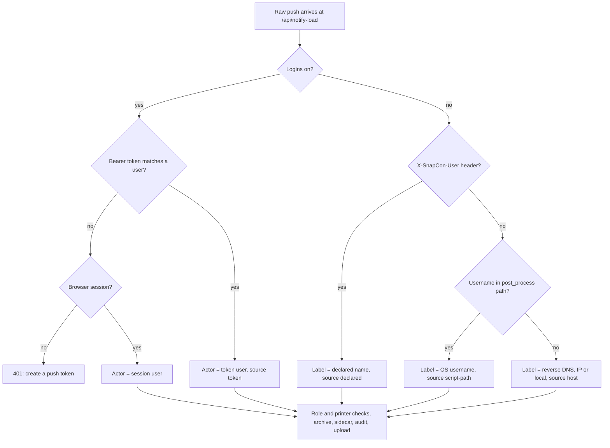

# Slicer push identity — design

Status: draft for review · 2026-10-06 · branch `feat/push-identity` (based on `main` at `510be2b`, after the archive work merged in #9)

## Why

The replay library files every slicer push under the person who sent it, and the Replay view filters by person. Today that attribution does not exist for the main path people use.

Pushes from Orca on another computer carry no credentials. With logins off they are all archived under `unknown/`; with logins on they are refused. The details, with code references, are in **Current design** below.

Target use: two or more people, each running Orca on their own computer, pushing to one SnapCon and one printer. Person 2 can later find person 1's print by person.

## Current design

Links are pinned to commit [`510be2b`](https://github.com/csmarshall/SnapCon/tree/510be2b6f31c1f16fc1b221a304f3ab2320968c3), the base of this branch on `main`, so line numbers stay valid as the branch moves.

### The slicer hook (CLI side)

- The CLI mode starts at [`server.js:331`](https://github.com/csmarshall/SnapCon/blob/510be2b6f31c1f16fc1b221a304f3ab2320968c3/server.js#L331): `--load`, `--printer`, `--outputname` and `--snapcon` are read from `process.argv`. It is the same executable as the server, run once per push and then exited.
- With `--snapcon <host[:port]>` ([`server.js:343-371`](https://github.com/csmarshall/SnapCon/blob/510be2b6f31c1f16fc1b221a304f3ab2320968c3/server.js#L343-L371)) it POSTs the file's bytes to `/api/notify-load?printer=…&outputname=…&filename=…` as `application/octet-stream`. The request headers are only `Content-Type` and `Content-Length`: **no cookie, no token, no user name**. The body is streamed straight from disk ([`server.js:370`](https://github.com/csmarshall/SnapCon/blob/510be2b6f31c1f16fc1b221a304f3ab2320968c3/server.js#L370)).
- Without `--snapcon` it uses the separate same-machine path: it reads the local notify token (`notifyToken.js`) and sends a JSON file path to the loopback-only branch. **This change does not touch that path.**

### Authentication (server side)

- [`auth.js:125-145`](https://github.com/csmarshall/SnapCon/blob/510be2b6f31c1f16fc1b221a304f3ab2320968c3/auth.js#L125-L145) `makeAuthMiddleware`. With `usersEnabled` off, every request becomes `{ role: "admin", implicit: true }` ([`auth.js:128`](https://github.com/csmarshall/SnapCon/blob/510be2b6f31c1f16fc1b221a304f3ab2320968c3/auth.js#L128)). With it on, the only credential recognised is the session cookie; the user record is copied onto `req.user`.
- [`server.js:456-461`](https://github.com/csmarshall/SnapCon/blob/510be2b6f31c1f16fc1b221a304f3ab2320968c3/server.js#L456-L461) `actorFromReq`: an implicit user gives `{ userId: null, userLabel: null }`; a real one gives their id and display name.
- Users live in `users.json`, held in memory as `USERS` and written whole by `saveUsers()` ([`server.js:312`](https://github.com/csmarshall/SnapCon/blob/510be2b6f31c1f16fc1b221a304f3ab2320968c3/server.js#L312)). `publicUser()` ([`server.js:4288`](https://github.com/csmarshall/SnapCon/blob/510be2b6f31c1f16fc1b221a304f3ab2320968c3/server.js#L4288)) is the allow-list of fields sent to the browser. User admin routes are `requireAdmin` ([`server.js:4597`](https://github.com/csmarshall/SnapCon/blob/510be2b6f31c1f16fc1b221a304f3ab2320968c3/server.js#L4597)). The only self-service user routes are `/api/session/theme` and `/api/session/locale` ([`server.js:4316`](https://github.com/csmarshall/SnapCon/blob/510be2b6f31c1f16fc1b221a304f3ab2320968c3/server.js#L4316)).

### The push route

- [`server.js:2785`](https://github.com/csmarshall/SnapCon/blob/510be2b6f31c1f16fc1b221a304f3ab2320968c3/server.js#L2785) `app.post("/api/notify-load", rawGcodeBody, …)`. A Buffer body selects the raw branch. There, [`server.js:2792-2793`](https://github.com/csmarshall/SnapCon/blob/510be2b6f31c1f16fc1b221a304f3ab2320968c3/server.js#L2792-L2793) returns 401 without `req.user` and 403 for a `view` role.
  - With logins off, the implicit admin passes both checks and the actor has no identity.
  - With logins on, the hook (no cookie) is refused. That is why remote pushes only work with logins off today.
- The printer is resolved and checked for visibility, and the bytes go to a temp file. Then `archiveInBackground` is started, not awaited, with `userLabel: actor.userLabel` ([`server.js:2822`](https://github.com/csmarshall/SnapCon/blob/510be2b6f31c1f16fc1b221a304f3ab2320968c3/server.js#L2822)); its `onDone` writes the audit entry built by `archiveAuditEntry` (`file-archived` or `file-archive-failed`, [`server.js:2826`](https://github.com/csmarshall/SnapCon/blob/510be2b6f31c1f16fc1b221a304f3ab2320968c3/server.js#L2826)). The file is handed to `uploadNotifiedFile`, which deletes the temp file ([`server.js:2834`](https://github.com/csmarshall/SnapCon/blob/510be2b6f31c1f16fc1b221a304f3ab2320968c3/server.js#L2834)); the archive keeps its own reference to the bytes.
- At startup, `sweepPartials` clears interrupted archive leftovers ([`server.js:2781`](https://github.com/csmarshall/SnapCon/blob/510be2b6f31c1f16fc1b221a304f3ab2320968c3/server.js#L2781)).
- `isLoopback()` ([`server.js:2772`](https://github.com/csmarshall/SnapCon/blob/510be2b6f31c1f16fc1b221a304f3ab2320968c3/server.js#L2772)) looks at `req.socket.remoteAddress`. Its own comment notes that Remote Access tunnel traffic also arrives as loopback, which matters for the `host` pseudo-identity below.

### The archive

- [`archivePush.js:190`](https://github.com/csmarshall/SnapCon/blob/510be2b6f31c1f16fc1b221a304f3ab2320968c3/archivePush.js#L190) `archivePush` computes the sha256 ([line 194](https://github.com/csmarshall/SnapCon/blob/510be2b6f31c1f16fc1b221a304f3ab2320968c3/archivePush.js#L194)) and, under a per-folder queue ([`inFolderQueue`, line 129](https://github.com/csmarshall/SnapCon/blob/510be2b6f31c1f16fc1b221a304f3ab2320968c3/archivePush.js#L129); case-insensitive key, at most 8 waiting), tries the candidate names `<name>`, `<name>-<sha8>`, `<name>-<sha256>` in `<root>/<safeSegment(userLabel, "unknown")>/<YYYY-MM-DD>/`.
- Each name is claimed by `claimAndWrite` ([line 155](https://github.com/csmarshall/SnapCon/blob/510be2b6f31c1f16fc1b221a304f3ab2320968c3/archivePush.js#L155)): an exclusive create of an empty placeholder, then the bytes written to a hidden `.partial`, then a rename (retried on `EPERM`/`EBUSY`/`EACCES`) over its own placeholder. Nothing is ever overwritten. A taken name is compared by `sameContent` ([line 114](https://github.com/csmarshall/SnapCon/blob/510be2b6f31c1f16fc1b221a304f3ab2320968c3/archivePush.js#L114)), whose read errors propagate.
- It returns `{ status: "archived", path }` ([line 200](https://github.com/csmarshall/SnapCon/blob/510be2b6f31c1f16fc1b221a304f3ab2320968c3/archivePush.js#L200)), `{ status: "duplicate", path }` when the same bytes are already there ([line 203](https://github.com/csmarshall/SnapCon/blob/510be2b6f31c1f16fc1b221a304f3ab2320968c3/archivePush.js#L203)), or `{ status: "error", error }`, including when every candidate name is taken by different content ([line 205](https://github.com/csmarshall/SnapCon/blob/510be2b6f31c1f16fc1b221a304f3ab2320968c3/archivePush.js#L205)).
- It does not return the hash or the size, and **nothing records who pushed, or to which printer, beyond the folder name and the audit log**.

### Things the new code relies on

- The Library scanner ([`library/Scanner.js:41-48`](https://github.com/csmarshall/SnapCon/blob/510be2b6f31c1f16fc1b221a304f3ab2320968c3/library/Scanner.js#L41-L48)) skips dot-files (`SKIP_FILE`), so `.partial` files are invisible to it, but classifies everything else by extension. A `.json` file falls through to role `other`, so the sidecars would be listed by the Library unless they are excluded explicitly.
- `library/gcodeExtract.js` already reads every `key = value` line of the trailing config block into `cfg` ([line 134](https://github.com/csmarshall/SnapCon/blob/510be2b6f31c1f16fc1b221a304f3ab2320968c3/library/gcodeExtract.js#L134)) using `parser._internal.matchCfgLine`. `post_process` would be among those keys, so the script-path lookup can reuse that parsing.
- Settings > View already has a per-user section, the language picker ([`public/index.html:417`](https://github.com/csmarshall/SnapCon/blob/510be2b6f31c1f16fc1b221a304f3ab2320968c3/public/index.html#L417)). The token block sits next to it.

## Goals

1. With logins **on**: each push is attributed to a real account, authenticated by a per-user token.
2. With logins **off**: each push gets a best-effort, clearly unverified pseudo-identity instead of `unknown`.
3. Record who pushed in a sidecar next to the archived file, so the Replay view has a durable source (the audit log is retained for about 90 days).

Non-goals: general API tokens; per-device tokens; changing the browser login flow; the Replay UI itself (separate spec).

## Behaviour

### Logins on — per-user push token

- One token per user. Format `snp_` + 32 random bytes, base64url (from `crypto.randomBytes`).
- Stored in `users.json` on the user record as `pushToken: { hash, createdAt, lastUsedAt }`, where `hash` is the hex sha256 of the full token. The plaintext is returned exactly once, when it is generated.
- Generating a new token replaces the old one, so every computer using the old token stops working at once.
- `publicUser()` exposes only `pushToken: { createdAt, lastUsedAt } | null`. The hash never leaves the server.
- Sent by the hook as `Authorization: Bearer <token>`.
- Accepted **only** on the raw-bytes branch of `/api/notify-load`. Everywhere else, a bearer header is ignored and the request is handled exactly as today. A leaked token can therefore push files to printers the user can see and do nothing else.
- Lookup: sha256 the presented token and compare it against each user's stored hash with `crypto.timingSafeEqual` (equal-length buffers). Users without a token are skipped.
- On a match, the request is treated as that user: role check (regular/admin only), printer visibility through `printerVisibleTo`, the actor through `actorFromReq`. `lastUsedAt` is updated, with writes to `users.json` throttled to at most once a minute per user so a busy push day does not rewrite the file constantly.
- No token, or an unknown or revoked one: 401, with the message `Push token missing or not recognised — create one in Settings > View > Slicer push token`. A browser session cookie on the raw branch keeps working as today.
- The token is never logged. Audit events: `push-token-created` (by the user or an admin) and `push-token-revoked` (by the user or an admin), category `auth`, with the actor and target user id.

### Logins off — pseudo-identity

Nothing can be verified, so the push is labelled with the first available of:

| Order | Source (`identitySource`) | How |
|---|---|---|
| 1 | `declared` | `--user "<name>"` on the hook or `SNAPCON_USER` in its environment, sent as header `X-SnapCon-User`. Trimmed, at most 64 characters, control characters rejected. |
| 2 | `script-path` | The OS username parsed from the slicer's `post_process` setting inside the pushed file: in G-code, the `; post_process = ...` line of the trailing config block (via `parser._internal.matchCfgLine`); in a 3MF, `post_process` in `Metadata/project_settings.config`. Pattern: the path segment after `Users` (Windows, macOS) or `home` (Linux) (`/[\\/](?:Users|home)[\\/]([^\\/]+)[\\/]/i`). Only the last 3 MB of the file are scanned, the same window the Library uses. |
| 3 | `host` | Reverse DNS of the peer address (`dns.promises.reverse`) with a 300 ms cap, otherwise the address itself. A loopback peer (same machine, or arriving through a tunnel or proxy) is labelled `local`. |

- A declared name or token sent while logins are off is not an error: the declared name is used, and the token is ignored and reported once at debug level.
- The label becomes the actor's `userLabel` (so the archive folder is `safeSegment(label)`); `userId` stays `null`.
- The UI shows these labels as unverified (Replay spec).

### Logins on, but the hook also sends `--user`

The token decides; a declared name is ignored. `identitySource` is `token`.

### Sidecar

After a successful `archivePush`, write or update `<archived file>.snapcon.json`:

```json
{
  "v": 1,
  "sha256": "<hex>",
  "size": 123456,
  "originalName": "Harper_plate1.gcode",
  "basedOn": null,
  "pushes": [
    { "at": "2026-10-06T15:52:53.000Z", "userId": "u_1", "userLabel": "Charles",
      "identitySource": "token", "printerId": "p_1", "printerName": "U1 White" }
  ]
}
```

- The sidecar is written inside `archivePush`, in the same per-folder queue turn as the archive itself, so two pushes of the same file cannot both append to it at once.
- `status: "archived"`: create the sidecar with one entry in `pushes`, using the same reserve-then-fill as the archive (`claimAndWrite`).
- `status: "duplicate"` (the same bytes were already archived at `path`): read the existing sidecar, append an entry, and replace it by writing a hidden `.partial` and renaming it over the sidecar. Replacing is intended here: the sidecar is ours, and the queue serialises writers. If the sidecar is missing (archived before this change) or unreadable as JSON, create a fresh one with the one new entry; an unreadable one is first renamed to `<name>.snapcon.json.corrupt-<timestamp>` rather than deleted.
- `basedOn` is reserved for the remix work and is always `null` here.
- A sidecar failure does not change the archive result: it is logged, audited as `file-archive-sidecar-failed`, and never blocks the print.
- The Library scanner must not list `*.snapcon.json`: extend `SKIP_FILE` in `library/Scanner.js`, and add a test. `sweepPartials` already covers the sidecar's `.partial` files.

## Changes by file

| File | Change |
|---|---|
| `pushIdentity.js` (new, top level) | `generateToken()`, `hashToken(t)`, `findUserByToken(users, presented)`, `identityFromRequest({ cfg, users, req, bytes, name, reverse })` returning `{ userId, userLabel, identitySource }`, and `scriptPathUser(bytes, name)`. Pure functions with `dns` injected, so unit tests need no server. |
| `archivePush.js` | Take the resolved identity (`userId`, `userLabel`, `identitySource`) and the printer; write or update the sidecar inside the folder queue turn (`writeSidecar`); return the sha256 and size on every result; `archiveAuditEntry` gains `file-archive-sidecar-failed`. |
| `server.js` raw branch of `/api/notify-load` | Resolve identity before the `req.user` check: bearer token when logins are on, pseudo-identity when off; then the existing role and visibility checks; pass the resolved identity and printer to `archiveInBackground` (archive, sidecar and audit all happen there) and the actor to `uploadNotifiedFile`. |
| `server.js` routes | `POST /api/session/push-token` (requireRegular; returns `{ token }` once); `DELETE /api/session/push-token` (requireRegular); `DELETE /api/users/:id/push-token` (requireAdmin). Each route on one line, so the source-grep tests can find it. |
| `server.js` CLI block | New `--token <t>` / `SNAPCON_TOKEN` and `--user <name>` / `SNAPCON_USER`, sent as headers on the `--snapcon` request. The flags take priority over the environment variables. Usage text updated. |
| `server.js` `publicUser` | Add `pushToken: { createdAt, lastUsedAt } \| null`. |
| `public/app.js` + `index.html` | Settings > View: a "Slicer push token" block for the signed-in user (Generate / Regenerate / Revoke; the token is shown once with a Copy button and the matching Orca post-processing line). Users table (admin): a "Revoke push token" action and the last-used time. Hidden when logins are off; a short note there explains `--user` instead. |
| `locales-default/en.json`, `es.json` | Every new string. |
| `Dockerfile` | `COPY` the new `pushIdentity.js` (enforced by `test/docker.test.js`). |
| `README.md` | The Orca plugin section: add `--token` and `--user`, with the logins on/off behaviour. |

## Identity resolution



## Security notes

- The token carries the same authority as the user's own push from the browser, limited to one route. Remote Access tunnels reach that route too, so a token can push over the tunnel exactly as a signed-in user can today.
- Only the hash is stored; a copy of `users.json` does not reveal working tokens.
- Declared names and script-path usernames are attacker-controlled text: they pass through `safeSegment` for the folder name, and the UI must render them with `textContent`/`esc()`.
- No change to the loopback file-path branch or `notifyToken.js`.

## Tests

- `pushIdentity`: token format and entropy length; hash round-trip; match, mismatch, revoked, and a user with no token; timing-safe compare called with equal lengths; declared-name trimming, length cap and control-character rejection; `scriptPathUser` on Windows, macOS and Linux paths, an empty `post_process` (as in a real Snapmaker Orca 3MF), a missing config block, and a 3MF; `host` fallback with a fake `reverse` that resolves, times out, and with a loopback peer.
- `archivePush` sidecar: created on `archived`; appended on `duplicate`; created when missing; a corrupt one is set aside as `.corrupt-<timestamp>`, never deleted; two concurrent pushes of the same bytes give one sidecar with two entries; a failed sidecar write leaves the archive result unchanged and produces `file-archive-sidecar-failed`.
- Route wiring (source-grep, as `test/archivePush.test.js` does): the bearer token is read only inside the raw branch; the three token routes exist with the right guards; the CLI forwards `--token`/`--user` as headers.
- An express test, in the style of `test/library/routes.test.js`: with logins on, a token push succeeds as that user, no token gives 401, and a `view` user's token gives 403. With logins off, a declared name lands in that folder.
- The Library scanner ignores `*.snapcon.json`.
- UI: the token block is hidden when logins are off (extracted into a `vm` test like `test/topbar.test.js`), and the token is inserted with `textContent`.

## Not verified

- The 401 with logins on is read from the code, not observed.
- Whether real hooked Orca G-code contains a `post_process` line with the script path. The one real file checked (`Harper.3mf`, Snapmaker Orca 2.3.6, no hook) has `post_process = []`. The first real push after this lands should confirm it.
- Nothing has been run against a real U1 or a real Orca push.
