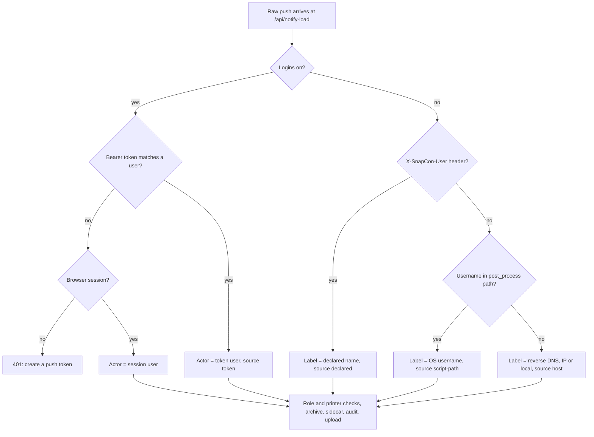

# Slicer push identity — design

Status: draft for review · 2026-10-06 · branch `feat/push-identity` (based on `feature/replay-archive`)

## Why

The replay library files every slicer push under the person who sent it, and the Replay view filters by person. Today that attribution does not exist for the main path people use:

- Orca's post-processing script calls the CLI hook with `--snapcon <host>`, which sends the raw file to `/api/notify-load` with **no credentials** (`server.js` CLI block, a bare `http.request`).
- With User Access Management **off**, the auth middleware makes every request an implicit admin with no user id, so every push is archived under `unknown/`.
- With User Access Management **on**, the raw-bytes branch requires `req.user`, so the hook gets a 401 (read from the code; not yet run against a live instance).

Target use: two or more people, each running Orca on their own computer, pushing to one SnapCon and one printer. Person 2 can later find person 1's print by person.

## Goals

1. With logins **on**: each push is attributed to a real account, authenticated by a per-user token.
2. With logins **off**: each push gets a best-effort, clearly unverified pseudo-identity instead of `unknown`.
3. Record who pushed in a sidecar next to the archived file, so the Replay view has a durable source (the audit log is retained for about 90 days).

Non-goals: general API tokens; per-device tokens; changing the browser login flow; the Replay UI itself (separate spec).

## Behaviour

### Logins on — per-user push token

- One token per user. Format `snp_` + 32 random bytes, base64url (from `crypto.randomBytes`).
- Stored in `users.json` on the user record as `pushToken: { hash, createdAt, lastUsedAt }`, where `hash` is the hex sha256 of the full token. The plaintext is returned exactly once, when it is generated.
- Generating a new token replaces the old one, so every computer using the old token stops working at once.
- `publicUser()` exposes only `pushToken: { createdAt, lastUsedAt } | null`. The hash never leaves the server.
- Sent by the hook as `Authorization: Bearer <token>`.
- Accepted **only** on the raw-bytes branch of `/api/notify-load`. Everywhere else, a bearer header is ignored and the request is handled exactly as today. A leaked token can therefore push files to printers the user can see and do nothing else.
- Lookup: sha256 the presented token and compare it against each user's stored hash with `crypto.timingSafeEqual` (equal-length buffers). Users without a token are skipped.
- On a match, the request is treated as that user: role check (regular/admin only), printer visibility through `printerVisibleTo`, the actor through `actorFromReq`. `lastUsedAt` is updated, with writes to `users.json` throttled to at most once a minute per user so a busy push day does not rewrite the file constantly.
- No token, or an unknown or revoked one: 401, with the message `Push token missing or not recognised — create one in Settings > View > Slicer push token`. A browser session cookie on the raw branch keeps working as today.
- The token is never logged. Audit events: `push-token-created` (by the user or an admin) and `push-token-revoked` (by the user or an admin), category `auth`, with the actor and target user id.

### Logins off — pseudo-identity

Nothing can be verified, so the push is labelled with the first available of:

| Order | Source (`identitySource`) | How |
|---|---|---|
| 1 | `declared` | `--user "<name>"` on the hook or `SNAPCON_USER` in its environment, sent as header `X-SnapCon-User`. Trimmed, at most 64 characters, control characters rejected. |
| 2 | `script-path` | The OS username parsed from the slicer's `post_process` setting inside the pushed file: in G-code, the `; post_process = ...` line of the trailing config block (via `parser._internal.matchCfgLine`); in a 3MF, `post_process` in `Metadata/project_settings.config`. Pattern: the path segment after `Users` (Windows, macOS) or `home` (Linux) (`/[\\/](?:Users|home)[\\/]([^\\/]+)[\\/]/i`). Only the last 3 MB of the file are scanned, the same window the Library uses. |
| 3 | `host` | Reverse DNS of the peer address (`dns.promises.reverse`) with a 300 ms cap, otherwise the address itself. A loopback peer (same machine, or arriving through a tunnel or proxy) is labelled `local`. |

- A declared name or token sent while logins are off is not an error: the declared name is used, and the token is ignored and reported once at debug level.
- The label becomes the actor's `userLabel` (so the archive folder is `safeSegment(label)`); `userId` stays `null`.
- The UI shows these labels as unverified (Replay spec).

### Logins on, but the hook also sends `--user`

The token decides; a declared name is ignored. `identitySource` is `token`.

### Sidecar

After a successful `archivePush`, write or update `<archived file>.snapcon.json`:

```json
{
  "v": 1,
  "sha256": "<hex>",
  "size": 123456,
  "originalName": "Harper_plate1.gcode",
  "basedOn": null,
  "pushes": [
    { "at": "2026-10-06T15:52:53.000Z", "userId": "u_1", "userLabel": "Charles",
      "identitySource": "token", "printerId": "p_1", "printerName": "U1 White" }
  ]
}
```

- `status: "saved"`: create the sidecar with one entry in `pushes`.
- `status: "duplicate"` (the same bytes were already archived): read the existing sidecar, append an entry, and write it back through a temp file plus `netfs.rename`. If the sidecar is missing (for example, archived before this change), create it with the one new entry.
- `basedOn` is reserved for the remix work and is always `null` here.
- Like the archive itself, a sidecar failure is logged and audited and never blocks the print.
- The Library scanner must not index `*.snapcon.json` (add a test that it ignores them).

## Changes by file

| File | Change |
|---|---|
| `pushIdentity.js` (new, top level) | `generateToken()`, `hashToken(t)`, `findUserByToken(users, presented)`, `identityFromRequest({ cfg, users, req, bytes, name, reverse })` returning `{ userId, userLabel, identitySource }`, and `scriptPathUser(bytes, name)`. Pure functions with `dns` injected, so unit tests need no server. |
| `archivePush.js` | Return the sha256 and size it already computes; add `writeSidecar({ fsApi, archivedPath, entry, meta })`. |
| `server.js` raw branch of `/api/notify-load` | Resolve identity before the `req.user` check: bearer token when logins are on, pseudo-identity when off; then the existing role and visibility checks; pass the resolved actor to `archivePush`, the sidecar, the audit log and `uploadNotifiedFile`. |
| `server.js` routes | `POST /api/session/push-token` (requireRegular; returns `{ token }` once); `DELETE /api/session/push-token` (requireRegular); `DELETE /api/users/:id/push-token` (requireAdmin). Each route on one line, so the source-grep tests can find it. |
| `server.js` CLI block | New `--token <t>` / `SNAPCON_TOKEN` and `--user <name>` / `SNAPCON_USER`, sent as headers on the `--snapcon` request. The flags take priority over the environment variables. Usage text updated. |
| `server.js` `publicUser` | Add `pushToken: { createdAt, lastUsedAt } \| null`. |
| `public/app.js` + `index.html` | Settings > View: a "Slicer push token" block for the signed-in user (Generate / Regenerate / Revoke; the token is shown once with a Copy button and the matching Orca post-processing line). Users table (admin): a "Revoke push token" action and the last-used time. Hidden when logins are off; a short note there explains `--user` instead. |
| `locales-default/en.json`, `es.json` | Every new string. |
| `Dockerfile` | `COPY` the new `pushIdentity.js` (enforced by `test/docker.test.js`). |
| `README.md` | The Orca plugin section: add `--token` and `--user`, with the logins on/off behaviour. |

## Identity resolution



## Security notes

- The token carries the same authority as the user's own push from the browser, limited to one route. Remote Access tunnels reach that route too, so a token can push over the tunnel exactly as a signed-in user can today.
- Only the hash is stored; a copy of `users.json` does not reveal working tokens.
- Declared names and script-path usernames are attacker-controlled text: they pass through `safeSegment` for the folder name, and the UI must render them with `textContent`/`esc()`.
- No change to the loopback file-path branch or `notifyToken.js`.

## Tests

- `pushIdentity`: token format and entropy length; hash round-trip; match, mismatch, revoked, and a user with no token; timing-safe compare called with equal lengths; declared-name trimming, length cap and control-character rejection; `scriptPathUser` on Windows, macOS and Linux paths, an empty `post_process` (as in a real Snapmaker Orca 3MF), a missing config block, and a 3MF; `host` fallback with a fake `reverse` that resolves, times out, and with a loopback peer.
- `archivePush`: the sidecar is created on `saved`, appended on `duplicate`, created when missing on `duplicate`, and a failed write does not throw.
- Route wiring (source-grep, as `test/archivePush.test.js` does): the bearer token is read only inside the raw branch; the three token routes exist with the right guards; the CLI forwards `--token`/`--user` as headers.
- An express test, in the style of `test/library/routes.test.js`: with logins on, a token push succeeds as that user, no token gives 401, and a `view` user's token gives 403. With logins off, a declared name lands in that folder.
- The Library scanner ignores `*.snapcon.json`.
- UI: the token block is hidden when logins are off (extracted into a `vm` test like `test/topbar.test.js`), and the token is inserted with `textContent`.

## Not verified

- The 401 with logins on is read from the code, not observed.
- Whether real hooked Orca G-code contains a `post_process` line with the script path. The one real file checked (`Harper.3mf`, Snapmaker Orca 2.3.6, no hook) has `post_process = []`. The first real push after this lands should confirm it.
- Nothing has been run against a real U1 or a real Orca push.
